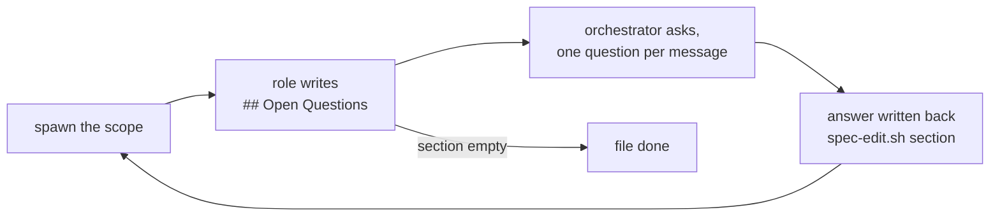
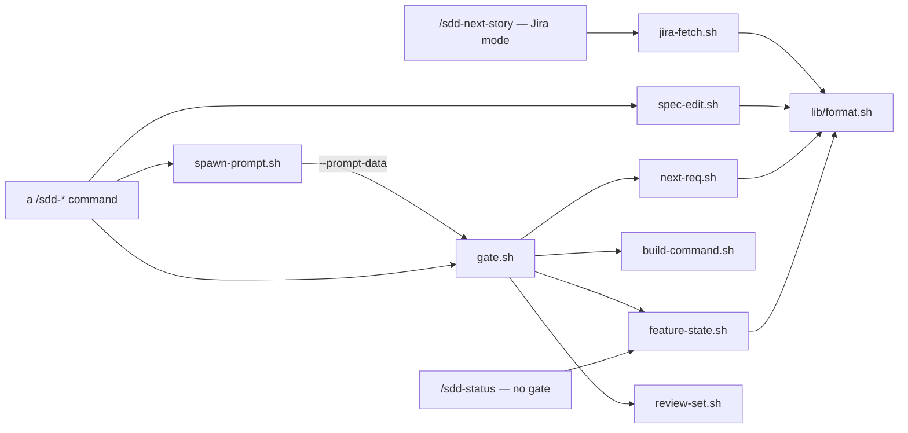

# The engine from the inside

For whoever edits the engine — a role, a command, a skill, a template. Using SDD needs none of
this; see `README.md`. Nothing reads this file at runtime.

---

## Layout

Everything the engine ships lives under `.sdd/`; everything outside it is never installed.
`.sdd/` is tool-neutral in its prose — host differences are packaging only (see *Adapters*).
Each path below holds exactly this, and a fact lives in one of them (see *Where a rule belongs*).

| Path | Holds |
|------|-------|
| `AGENTS.md` | Only what *every* role needs — loaded into the orchestrator and all five roles. |
| `commands/*.md` | The nine `/sdd-*` steps: step order and the points where the human decides. What every command does alike is in `protocols/orchestration.md`. |
| `agents/*.md` | The five roles — what tells each apart (see *Agent files*). |
| `protocols/*.md` | The procedures, each naming its addressee in its first line. |
| `prompts/*.md` | One assignment per scope of the gate's `SPAWN:` table: this run's data, the scope, what the role returns. |
| `scripts/*.sh` | A rule that reads project state and returns a fact; `lib/format.sh` reads the `_docs/` formats, `lib/log.sh` records each run. |
| `skills/*/SKILL.md` | The craft of a discipline, as rules with links into `references/`. |
| `templates/*.md` | The structure of every generated file. Not a channel for instructions. |
| `rules/*.md` | Text needed from the first token (see *Adapters* for who inherits it). None shipped. |
| `_gitignore.<host>`, `_claude/settings.json` | Host packaging: the `.gitignore` block; Claude Code session settings that turn off bundled skills, claude.ai connectors and `claude-in-chrome`. |
| `log/`, `sdd.conf`, `.sdd-manifest` | Not shipped — written in the project at run or install time. |

`tests/` holds fixtures, goldens and `run.sh` (`install/` for the installer).

### What install.sh puts where

**One host per project, and the two layouts are exclusive.** Copilot CLI reads `.claude/agents/`,
`.claude/commands/` and `.claude/skills/`, so a combined layout would have each host reading the
other's files — one agent with two definitions, one command defined twice.

| Engine path | `--for claude` | `--for copilot` |
|---|---|---|
| `.sdd/protocols/` `prompts/` `scripts/` `templates/`, any new folder | same path | same path |
| `.sdd/rules/X.md` | same path **and** `.claude/rules/X.md` | same path **and** `.github/instructions/X.instructions.md` |
| `.sdd/commands/sdd-X.md` | `.claude/commands/sdd-X.md` | `.github/skills/sdd-X/SKILL.md` |
| `.sdd/agents/<role>.md` | `.claude/agents/<role>.md` | `.github/agents/<role>.agent.md` |
| `.sdd/skills/<name>/` | `.claude/skills/<name>/` | `.github/skills/<name>/` |
| `.claude/skills/<name>/` in the clone | `.claude/skills/<name>/` | — |
| `.agents/skills/<name>/` in the clone | — | `.github/skills/<name>/` |
| `.sdd/_claude/settings.json` | `.claude/settings.json` | — |
| `.sdd/_gitignore.<host>` | block in `.gitignore` | block in `.gitignore` |
| `.sdd/AGENTS.md` | block in `CLAUDE.md` | block in `.github/copilot-instructions.md` |

- Every file is a **real copy**, not a link, and **nothing is generated per host** — one file
  per role and per command serves both; what that costs is under *Adapters*. The two blocks are
  merged between markers (`merge_md`, `remove_block`); the files they land in belong to the
  project.
- **`rules/` is the only entry that adds a destination instead of replacing one.** Roles are told
  the `.sdd/rules/` path, valid on every host; the second copy makes it always-on for the main
  session. Copilot recognises `.github/instructions/` files only by the `.instructions.md` suffix.
- The core is merged **once**. Copilot CLI reads both `AGENTS.md` and `CLAUDE.md`, so writing
  both would load it twice. A host that reads only `AGENTS.md` (Codex…) sees no engine.
- **`.sdd/.sdd-manifest`** — the host, then `path<TAB>checksum` per copied file, sorted.
  Directories and merged files are not listed. Every mode works from it:

  | Mode | With the manifest |
  |---|---|
  | install | writes it from what this run copied; a symlink from an old install is replaced like any foreign file |
  | `--sync` | checksum differs → the project edited the file, ask; `prune_target` removes paths the engine no longer ships |
  | `--uninstall` | removes exactly the listed files |

  There is no migration path beyond this.
- The `.gitignore` block ignores `.sdd/*` (not `.sdd/`, so a negation can exempt a file) and the
  host directory whole — which also keeps engine files out of `/sdd-code-review`'s change set.
  A project's *new* file there is ignored too: exempt it with a negation below `# SDD:END`
  (`!.github/workflows/`) or `git add -f`.
  `sdd.conf` stays ignored because it may hold `JIRA_TOKEN`; a team sharing build commands keeps
  the token in `~/.config/sdd-kit/tokens.env` and runs `git add -f .sdd/sdd.conf`.

---

## How a command runs

| Who | Owns |
|---|---|
| the human | Runs every command. Nothing chains; every decision is put to them. |
| the command `.sdd/commands/*.md` | The step order of this step. |
| `gate.sh` | Every precondition, the wording of every stop, and the `SPAWN:` table (`role \| protocols \| scope`) — one edit in one file to add a role or rename a protocol. |
| `spawn-prompt.sh` | Renders `.sdd/prompts/<command>-<scope>.md` into one assignment, taking values from `gate.sh --prompt-data` outside the orchestrator's context. Opens every prompt with the working directory — the root of every relative path in it. |
| the protocol `.sdd/protocols/*.md` | The procedure the role performs. Reaches the role only inside the prompt; the only protocol a command names is `orchestration.md`. |
| the agent `.sdd/agents/*.md` | Does the assignment and writes its files. Never reads a command file, never learns the flow. |
| `spec-edit.sh` | Writes whose format, place and date are fixed. The command supplies only the words. |
| `jira-fetch.sh` | Everything about Jira: config keys, REST call, wiki-markup → Markdown, attachments. The only script that touches the network or needs `curl`/`jq`. |

**A command does five things and nothing else:** run `gate.sh` (a `stop` or `ask` ends the run
there, in the gate's words); spawn each role its `SPAWN:` records name, with the prompt
`spawn-prompt.sh` renders, word for word; write what only it can write, through `spec-edit.sh`;
check with `gate.sh --verify` plus the build; report and name the next command. How each is done
is `orchestration.md`.

---

## Who runs what

| Command | Role · scope | Protocols | Orchestrator writes (via `spec-edit.sh` unless noted) |
|---|---|---|---|
| `/sdd-init` | architect · baseline-from-codebase — brownfield only | project-baseline, docs-format | `scaffold init` (both branches, before spawn); `arch-index` after; `.sdd/sdd.conf` — its only write outside `_docs/` |
| `/sdd-next-story` | — | — | `scaffold feature`, then `section` or `jira-fetch.sh --out` (rewrites `raw.md` whole) |
| `/sdd-specify` | requirements-engineer · requirements architect · design+tasks | spec-modes, requirements-writing, docs-format spec-modes, architecture-design, task-breakdown, docs-format | `backup`, then `scaffold spec` over the files this run writes |
| `/sdd-spec-review` | same two roles and scopes | as for specify, plus spec-checklist, interview | `status` markers; answers into `## Open Questions` via `section` |
| `/sdd-implement` | backend-developer · backend frontend-developer · frontend | developer, task-loop | nothing |
| `/sdd-code-review` | code-reviewer · review-set | code-review, docs-format | `backup`, `scaffold review`, then the report |
| `/sdd-code-fix` | backend/frontend-developer · findings-backend/-frontend | developer | `marker` (`TODO Code Review:`), `verdict-stale` |
| `/sdd-actualize` | architect · baseline-from-feature | project-baseline, docs-format | `backup`, `compile-entry` into `requirements.md`; `arch-index` after |
| `/sdd-status` | — | — | nothing — the report goes to chat |

- **Scaffold before spawn**: a role opens a file already on disk rather than looking for the
  template. `/sdd-specify` scaffolds only the files this run writes, never ones the human kept.
- **`/sdd-implement`** spawns only the stacks the breakdown carries, backend first; the frontend
  spawn gets what the backend came back blocked on.
- **`/sdd-code-fix`** drops the record of a stack with no finding marked *fix*. No
  `task-loop.md`, so `tasks.md` marks are untouched.
- **One protocol set per role per kind of assignment**, and it is the whole of what the agent
  does under it.

**`/sdd-spec-review` loops per scope; no role stays alive across rounds.**

The prompt is the same every round — one idempotent instruction: run the checklist, settle what
you can, ask the rest, fold in questions that already have an answer. The difference between
rounds is on disk. At most three rounds per spec file per session; an interrupted review starts
the count again.

**State is a file in the working tree, never the chat.** Commands never chain (`/sdd-code-review`
writes `review.md`, `/sdd-code-fix` reads it); such a file names its writer and scope in its
header, and exactly one command owns each field. Between spawns of one command, state is on the
page too (`## Open Questions`).

Behaviour worth knowing:

- A task whose build keeps failing is marked `BLOCKED`; the loop moves on.
- A task of a stack no developer covers stops `/sdd-implement`.
- Before an overwrite, all of `_docs/` is copied to `_docs/.backup/<timestamp>/`.
- `REQ-###` are numbered at `/sdd-specify`, reach `requirements.md` only at `/sdd-actualize`.
- `_docs/architecture.md` (`scaffold init --mono`) may replace `architecture/` — never both.

---

## Where a rule belongs

**A fact lives in one file** (see *Layout*). Everywhere else: a one-line reference, or nothing.

**When two files could hold it, the one always in context wins** — `AGENTS.md` over a protocol or
prompt, a protocol over the prompt naming it, `orchestration.md` over a command file, a skill over
the agent file that loads it. The one exception: protocols that never share a spawn keep their
copy (`code-review.md` / `task-loop.md` both define *covered*; `architecture-design.md` /
`project-baseline.md` both carry *purpose, not file counts*).

### What a file may know

A file that knows something it must not is a defect even when the run comes out right. This rule
lives here only — a copy in `AGENTS.md` would tell every role that commands and protocols exist.

| | Command | Agent | Protocol |
|---|---|---|---|
| **May name** | commands, protocols, scripts, templates, roles, `_docs/` paths | its skills, frameworks, tools of its trade | to the agent: protocols, scripts, templates, `_docs/` paths, formats. To the command (`orchestration.md` only): commands, protocols, scripts |
| **May not** | hold a role's procedure; name a tool | name a command, protocol, script, template, `_docs/` path, SDD, or an engine format (`REQ-###`, `TASK-###`, `A-##`, `status:`, `## Out of Scope`) | name an agent |

Under Copilot a command is *packaged* as a skill (`.github/skills/sdd-X/SKILL.md`) because the
host has no other slot for a step a human types; it is still a command.

### Agent files

**Test: it still reads correctly on a project that never heard of SDD.** A line belongs to the
agent only if it is true of this role under every assignment and untrue of every other role:

- changes with the assignment → the prompt's;
- identical in another role → `AGENTS.md`'s;
- a step in a sequence → a protocol's;
- craft several roles need → a skill's.

Second filter, price: the file is injected whole on every spawn, so a line the role cannot
violate does not pay for itself.

| Section | Holds | Gone wrong when |
|---|---|---|
| frontmatter | `name`, `description` (two sentences: what, when) | `tools:`, `model:` or `skills:` came back, or engine vocabulary appears |
| **Purpose** | what the role owns and **what it does not** — with `tools:` gone, this is what stops `code-reviewer` writing code | it describes *how* |
| **Expertise** | rules that can be broken | it lists topics |
| **Edge Cases** | *when X, do Y instead of the obvious* | it lists things "to consider" |
| **Self-Check** | stack/discipline checks the protocol cannot know | it repeats a protocol's checklist |
| **Skills** | load the installed skills whose description matches the work; the Obsidian skill before writing `.md` | it names a skill or explains delivery |

No agent file names a stack or addresses the engine's editor: roles are split by layer
(backend, frontend), and a stack is swapped by installing its skills, not by editing a role. A condition on a skill is a
property of the work (*the diff touches JPA entities*), never a place in the flow.

---

## Scripts

A step that derives a fact from project state — a count, a number, a command, a diff — belongs in
`.sdd/scripts/`, not in prose an agent re-interprets every run. **Each script's header comment is
its spec** — keys, sections, exit codes, config. Exit codes and gate verdicts, as the command
sees them, are in `orchestration.md`.

- **Output**: `KEY=value` lines, then `SECTION:` blocks, one record per line; print what was read
  next to what was resolved.
- **The orchestrator does not read what it does not decide from.** A spawn passes spec file
  *paths*, not contents. `TASKS:` is the exception — the coverage matrix is the orchestrator's.
- **A format is read in one place** — `lib/format.sh`, sourced by readers and writers.
- **Nothing tool-specific**: both hosts run the same scripts. `review-set.sh` excludes `_docs/`,
  `.sdd/`, `.claude/` but not `.github/` — the `.gitignore` block already hides the engine there,
  and excluding it would drop the project's workflows.
- **bash 3.2 is the floor** (macOS): no `mapfile`, no `${#array[@]}` under `set -u`, no GNU BRE.
- **Only the human's build command is run.** `build-command.sh` reads `SDD_BUILD_*` from
  `.sdd/sdd.conf`; detection is a proposal carried in the gate's `ASK:`, never run. Resolved once
  per command run and passed in every prompt.
- **The log (`lib/log.sh`) is written, never read** — no script, prompt or command branches on
  it. It wraps each script by re-exec; stdout, stderr and exit code stay byte-identical, and the
  goldens assert it.
- **Tests**: `tests/run.sh` diffs each fixture against `golden/` (verdicts), `golden-prompt/`
  (prompts, refusals), `golden-verify/` (postconditions), `golden-edit/` (ops). Wording counts.
  Goldens change only via `run.sh --update`, after reading the diff — never to turn red green.
  `tests/install/run.sh` covers the installer.

---

## Adapters

**The mapping lives here only.** Command files use the terms of `.sdd/protocols/orchestration.md`;
a new host swaps a column and changes no command or protocol.

| Term | Claude Code | Copilot — CLI and VS Code |
|------|-------------|---------------------------|
| Run `<script>` | `Bash` | `shell` |
| Spawn `<role>` | `Agent`, `subagent_type: <role>` | delegation to that agent, whole assignment in the text |
| Ask the human, with options | `AskUserQuestion` | CLI prompt; VS Code: a prose list |
| Ask the human, plain prose | one question per message | the same |
| The orchestrator's own | `Read` / `Write` / `Edit` | the host's file tools |

There is no *continue `<role>`*: VS Code sub-agents are stateless, so state goes on the page.

How the hosts differ where it matters (*measured* = checked by a run, not taken from docs):

| Mechanism | Claude Code | Copilot CLI | VS Code Copilot |
|---|---|---|---|
| Core (`CLAUDE.md` / `copilot-instructions.md`) in a sub-agent | yes — `AGENTS.md` is paid for in six contexts | no channel at all (measured) | yes |
| `.sdd/rules/` in a sub-agent | inherited | not inherited (measured) — the prompt names the path | yes |
| `disable-model-invocation` on commands | hidden from the model | hidden interactively (measured); under `-p` the command is gone | not measured |
| `disallowed-tools` on `sdd-status` | enforced | inert | inert |
| Structured questions | `AskUserQuestion` | CLI prompt | prose list |

- **Where a key is not enforced, the same constraint is also prose** in the file. That is why
  role frontmatter is `name` and `description` only: the hosts spell `tools:` differently and
  `model:` means nothing to Copilot. So `code-reviewer`'s write ban is prose, and every role runs
  on the session's model.
- `disable-model-invocation` is human-in-the-loop as a mechanism, and keeps the command's
  description out of context.
- **Sub-agents cannot ask.** The orchestrator puts the question and writes the answer into the
  file the next spawn reads.

### Skills

- **Only the engine's own skills are shipped**; a copy of a third-party skill would go stale and
  carry a foreign licence.
- **An installed skill is an engine file** once `install_installed_skills` copies it: in the
  manifest, synced, pruned. A name clash with an engine skill or command is skipped and named.
  `.claude/skills/`, `.agents/skills/` and `skills-lock.json` are git-ignored in this repo;
  install tests use a copy of `.sdd/` so nothing installed reaches a golden.
- **`description` is what gets a skill loaded** and is charged in every context: two sentences —
  the stack and the work. Developer prompts ask the role to name what it loaded.
- **`SKILL.md` is an index of rules with links**, ~6 KB (bytes, not lines); no *When to use*, no
  philosophy. `references/` are read on a pointer, never injected.
- A skill's script runs on both hosts from inside a delegated agent (measured).

### Session settings

`.sdd/_claude/settings.json`, Claude Code only, turns off what an SDD session never uses but
pays for in every request: bundled skills (`.claude/skills/`, and so every SDD skill, stays),
claude.ai connectors, and the `claude-in-chrome` MCP server. It is a copy like any engine file; `deniedMcpServers` merges across
sources, so re-enabling a server means editing this file. Local settings go in
`.claude/settings.local.json`; a `.claude/settings.json` the installer did not write is left alone.
