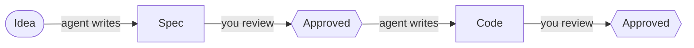
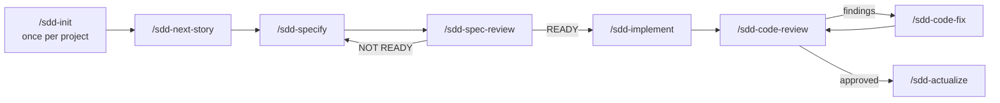

# SDD Kit — Spec-Driven Development for Claude Code and GitHub Copilot

**Spec-driven development (SDD)** means the agent writes a spec before it writes code,
and you review each one before the agent moves on.



SDD Kit adds this flow to any project as slash commands, agent roles and skills.

- Works with **Claude Code** or **GitHub Copilot** (CLI or VS Code). Pick one per project.
- All state is plain Markdown in your project's `_docs/`. There is no database or server.
- Commands never commit. Each one writes its files and stops.

**Requirements:** Claude Code or Copilot · `bash` 4+ (macOS: `brew install bash`) · `git` ·
`curl` + `jq` (only for Jira import).

---

## 1. Get the kit

```bash
git clone https://github.com/akolpako/sdd-kit.git ~/dev/sdd
```

Keep the clone. Projects are installed and updated from it.

## 2. Add skills (optional)

Install skills **once, into the clone**. Every project gets them on the next sync.
See the [skill list](#skills) for what is included and what we recommend.

```bash
cd ~/dev/sdd
npx skills add <repo> --skill <name> -a claude-code --copy     # for Claude Code projects
npx skills add <repo> --skill <name> -a github-copilot --copy  # for Copilot projects
./install.sh --sync --all
```

## 3. Install into a project

```bash
./install.sh          # pick the project folder and the host (Claude Code or Copilot)
./install.sh --sync   # later: update a project after the kit or its skills change
```

Both commands are interactive. Your edits to kit files are never overwritten without asking.
`_docs/` and `.sdd/sdd.conf` are yours and stay on uninstall.
For scripts and uninstall, see [installer options](#installer-options).

**Notes:** one host per project (to switch, uninstall and install again) · kit files are
git-ignored, so every teammate runs the installer · add `_docs/**/.backup/` to `.gitignore` ·
for Claude Code the kit adds `.claude/settings.json`, which turns off built-in features SDD
does not use.

## 4. Configure

```sh
# ~/.config/sdd-kit/tokens.env — global, optional
JIRA_URL=https://jira.example.com   # only for Jira import (Server / Data Center)
JIRA_TOKEN=<token>

# .sdd/sdd.conf — per project, overrides global; created by /sdd-init
SDD_BUILD_ROOT=mvn clean verify     # build + test command; or SDD_BUILD_BACKEND / SDD_BUILD_FRONTEND
SDD_LOG=0                           # optional: log to .sdd/log/ is on by default, 0 turns it off
```

---

## The flow



| Command | What it does | Writes |
|---|---|---|
| `/sdd-init` | Reads the code and writes the project baseline. Asks for the build command. Safe to re-run. | `architecture/`, `requirements.md`, `code-style.md`, `.sdd/sdd.conf` |
| `/sdd-next-story Cart` | Starts a feature. Pass a Jira key or link to import the issue instead. | `Cart/raw.md` |
| `/sdd-specify Cart` | Writes requirements, design and tasks as drafts. | `new-requirements.md`, `design.md`, `tasks.md` |
| `/sdd-spec-review Cart` | Checks the spec and asks you questions one at a time. Result: `READY` or `NOT READY`. | answers in the spec files |
| `/sdd-implement Cart` | Implements the tasks in order. A task is done only when the build passes. | code, `tasks.md` |
| `/sdd-code-review Cart` | Reviews the code against the spec and the code style. Does not change code. | `review.md` |
| `/sdd-code-fix Cart` | Fixes the review findings, then sends you back to review. | code |
| `/sdd-actualize Cart` | Adds the feature to the project baseline. | `requirements.md`, `architecture/` |
| `/sdd-status [Cart]` | Shows where each feature is and what to run next. Changes nothing. | — |

- Read and review each step's output before you run the next command.
- Code review, code fix and actualize are optional.
- Work on one feature at a time.
- **Stacks:** agents are stack-neutral and load the installed skills that match the code.
  The kit ships Java / Spring Boot and Angular skills; for another stack, install its skills.
- **Model:** use your strongest model for `/sdd-specify` and `/sdd-spec-review`.

## The docs

```
_docs/
├── architecture.index.md       table of contents of the architecture (generated)
├── architecture/*.md           architecture baseline, one file per topic — edit freely
├── requirements.md             all REQ-### of finished features
├── code-style.md               code conventions, proposed by /sdd-init, approved by you
└── <Feature>/
    ├── raw.md                  your feature description, the only file you write
    ├── new-requirements.md     requirements with acceptance criteria
    ├── design.md               architecture, data model, API contracts
    ├── tasks.md                tasks, each linked to requirements
    ├── review.md               latest code review: findings and verdict
    └── attachments/            images from Jira import
```

Spec files have `status: draft | ready` in their frontmatter. You can open `_docs/` as an
[Obsidian](https://obsidian.md) vault. The files also display fine on GitHub.

---

## Skills

**Included** (in `.sdd/skills/`):

| Skill | Covers |
|---|---|
| `java-core` | Java language rules |
| `java-springboot` | Spring Boot: DI, config, web, transactions, testing |
| `java-jpa` | JPA / Hibernate: entities, fetching, locking, schema |
| `java-junit` | JUnit 5, Mockito, AssertJ |
| `maven-lib-source` | Reads a dependency's source from its jar instead of guessing |
| `angular-practices` | Angular: `OnPush`, state, subscriptions |

**Recommended** from [skills.sh](https://skills.sh). Agents find and load them automatically.

| For | Install |
|---|---|
| Angular reference | `npx skills add angular/skills --skill angular-developer` |
| Obsidian syntax | `npx skills add kepano/obsidian-skills --skill obsidian-markdown` |
| Clean Architecture | `npx skills add wondelai/skills --skill clean-architecture` |
| Domain-Driven Design | `npx skills add wondelai/skills --skill domain-driven-design` |
| Clean Code | `npx skills add wondelai/skills --skill clean-code` |
| Requirements analysis | `npx skills add jwynia/agent-skills --skill requirements-analysis --full-depth` |
| Shorter replies | `npx skills add juliusbrussee/caveman --skill caveman` |

## Installer options

| Command | Does |
|---|---|
| `--target <path> --for claude\|copilot` | install without questions |
| `--sync <path>` / `--sync --all` | update one / all projects without questions |
| `--force` / `--keep-edits` | on sync: overwrite / keep your edits without asking |
| `--uninstall <path>` | remove the kit from a project |

---

Working on the kit itself? See [`ENGINE.md`](ENGINE.md).
